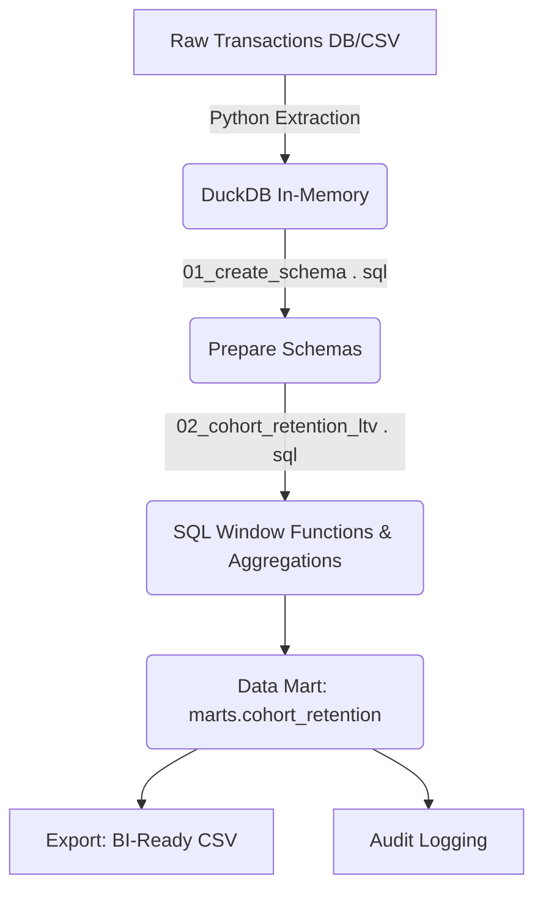

# Architecture & Design

The `CohortLTV-Engine` employs a modern, lightweight embedded analytics architecture, eliminating the need for complex,
always-on data warehouse instances while delivering extreme performance.

## Core Flow

## Technology Stack

- **Execution Engine**: DuckDB. Utilizes vectorized query execution to process millions of rows locally. *(Benchmarked
  at processing 1,000,000 rows in ~174ms, significantly exceeding the 5-second SLA).*
- **Orchestrator**: Python 3.10 ETL Script.
- **Automation**: Scheduled GitHub Actions runner (cron).
- **Visualization Integration**: CSV/Parquet flat-file handoff to BI Layers.
