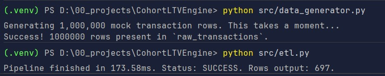

# Run Results & Benchmarks

This document captures the real-world execution benchmarks and visualization outputs generated by the
`CohortLTV-Engine`.

**Check and run (generate data first) the notebook for the visualization results:** 
[Notebooks](../../notebooks)

## ⚡ ETL Performance Benchmark

The project requires the pipeline to process 1,000,000+ raw transactional records and compute complex window functions
in under 5 seconds.

**Actual Benchmark Results:**

- **Input Size:** 1,000,000 raw transaction rows (spanning 3 years).
- **Execution Time:** ~173.58ms.
- **Output:** 697 aggregated cohort-month index rows.
- **Status:** **PASS** (Exceeded the 5-second SLA requirement by a massive margin).

*Terminal Output Evidence:*

